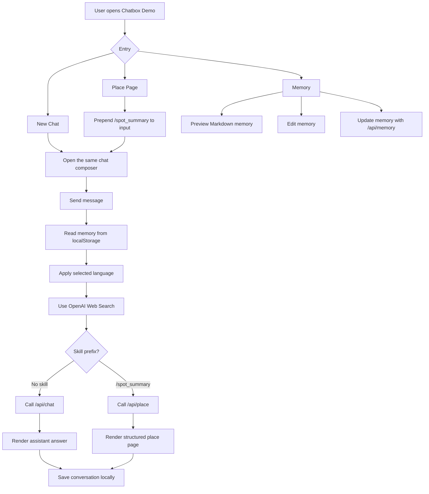
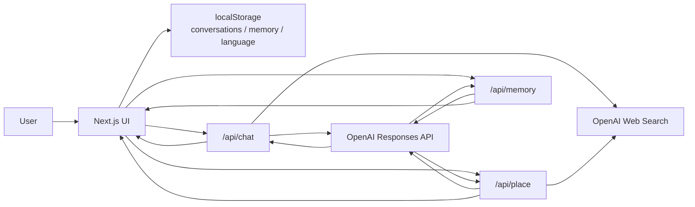

# Chatbox Demo

**日本語** | [English](docs/README.en.md) | [中文](docs/README.zh-CN.md)

Chatbox Demo は、2C 向け AI アシスタントの使い方を小さく試す Web デモです。  
目的はフル機能のチャットアプリを作ることではなく、長期記憶、構造化された Skill 出力、Web 情報を使った場所ページを、ひとつのシンプルな UI の中で見せることです。

## Demo

[公開デモを開く](https://chatbox-demo-rho.vercel.app)

[](docs/assets/chatbox-demo-walkthrough.mp4)

[動画を直接開く](docs/assets/chatbox-demo-walkthrough.mp4)

## 背景

一般ユーザー向け AI では、強いモデルをそのまま置くだけでは十分ではありません。ユーザーの日常、好み、移動、関心を自然に扱い、必要な場面で分かりやすい形に変換することが重要です。

このデモでは、その考えを小さく実装しています。

- 通常のチャットも、記憶文書と Web Search を文脈として使う。
- Memory 画面では、ユーザーの長期文脈を Markdown として見える形にする。
- Place Page は別フローではなく、同じ入力欄の先頭に `/spot_summary` を入れる Skill 起動ボタンとして扱う。
- 入力欄で `/spot_summary` が検出された時だけ、場所向けの構造化出力を実行する。

## 主な機能

- **New Chat**: 記憶と Web Search を使う通常チャット。
- **Place Page**: `/spot_summary` を入力欄に追加し、場所名から構造化ページを生成。
- **Memory**: ユーザー記憶を Markdown でプレビュー、編集、更新。
- **Chat History**: 会話が始まった後だけ履歴に表示。
- **Language Switch**: UI と回答言語を日本語、英語、中国語に切り替え。漢字だけの地名でも、選択中の言語を優先します。
- **Local-first Storage**: 会話、記憶、言語設定はブラウザの `localStorage` に保存。

## 使い方

```bash
npm install
npm run dev
```

ブラウザで `http://localhost:3000` を開きます。

## 環境変数

`.env.example` を `.env.local` にコピーして設定します。

```bash
OPENAI_API_KEY=
OPENAI_MODEL=gpt-5.4-mini
OPENAI_PLACE_MODEL=gpt-5.5
```

`.env.local` は Git に含めません。API key は GitHub にコミットしないでください。

## 動作フロー



## アーキテクチャ



## プロジェクト構成

```txt
app/
  api/
    chat/      # 通常チャット API
    memory/    # 記憶更新 API
    place/     # 場所ページ生成 API
components/   # UI components
lib/          # data model, storage, i18n, fallback logic
docs/         # English / Chinese README
```

## 実装上の判断

このデモでは、あえて複雑な仕組みを入れていません。

- ログインなし
- データベースなし
- ベクトル検索なし
- 地図 API なし
- 複雑な Agent framework なし

理由は、何を見せたいかを明確にするためです。中心は、AI をただのチャット欄ではなく、ユーザー文脈と Skill 的な出力モードを持つプロダクトとして見せることです。

## 今後の改善案

- 公開デモサイトとしてデプロイする。
- Place Page のリソース抽出精度を改善する。
- Memory 更新の差分確認 UI を追加する。
- デモ用の初期ユーザー記憶を複数パターン用意する。
- API 利用量を抑えるための簡単な rate limit を追加する。

## 注意

このリポジトリには個人メモや開発中の補助ファイルは含めません。公開するのは、アプリ本体、README、実行に必要な設定テンプレートのみです。
