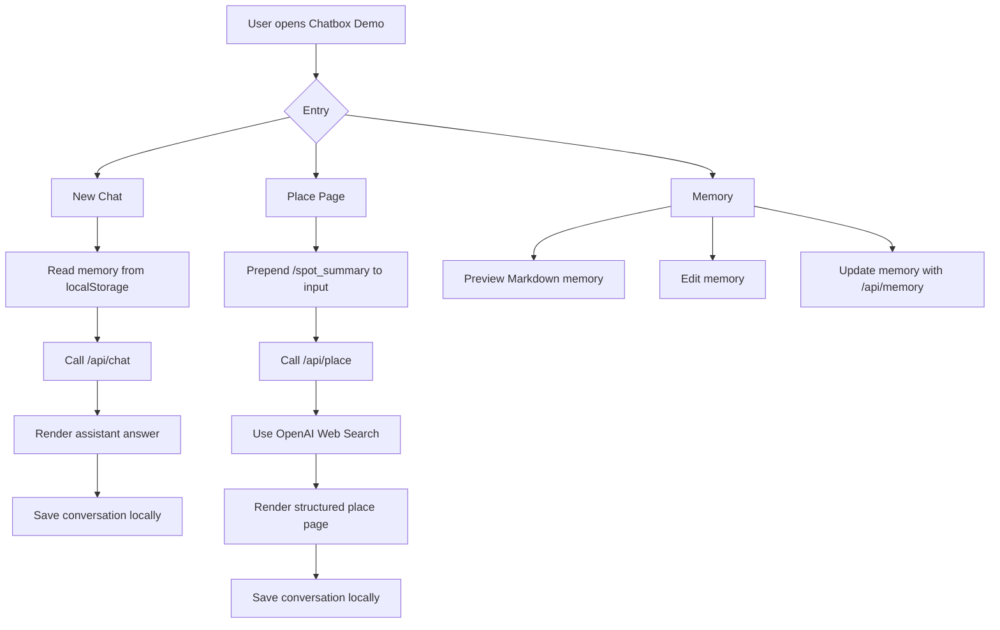
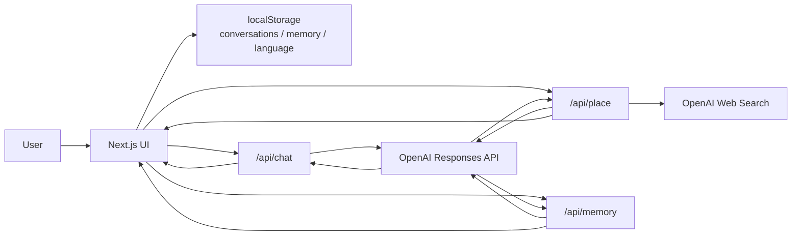

# Chatbox Demo

[日本語](../README.md) | **English** | [中文](README.zh-CN.md)

Chatbox Demo is a small web demo inspired by Agent i-style consumer AI assistants.  
It is not intended to be a full chat product. The goal is to demonstrate long-term memory, skill-like structured output, and web-backed place summaries inside a simple, usable interface.

This project is built as a portfolio demo for a LINE Yahoo / Agent i-related role. It is not an official product.

## Why This Demo

For consumer AI, a powerful model alone is not enough. The assistant should understand user context, fit into everyday scenarios, and turn vague requests into useful product surfaces.

This demo explores that idea in a compact way:

- Normal chat can use a long-term memory document.
- Memory is visible and editable as Markdown.
- Place Page mode uses `/spot_summary` as a lightweight skill trigger.
- Place pages use web search so resources and answers are grounded in current online information.

## Features

- **New Chat**: normal OpenAI-powered chat.
- **Place Page**: structured place summary with resources, overview, and user-relevant points.
- **Memory**: preview, edit, and update long-term Markdown memory.
- **Chat History**: conversations appear after messages exist.
- **Language Switch**: Japanese, English, and Chinese UI.
- **Local-first Storage**: conversations, memory, and language settings are stored in browser `localStorage`.

## Run Locally

```bash
npm install
npm run dev
```

Open `http://localhost:3000`.

## Environment Variables

Copy `.env.example` to `.env.local`.

```bash
OPENAI_API_KEY=
OPENAI_MODEL=gpt-5.4-mini
OPENAI_PLACE_MODEL=gpt-5.5
```

Do not commit `.env.local` or any API key.

## Flow



## Architecture



## Project Structure

```txt
app/
  api/
    chat/      # normal chat API
    memory/    # memory update API
    place/     # structured place page API
components/   # UI components
lib/          # data model, storage, i18n, fallback logic
docs/         # localized README files
```

## Scope

The demo intentionally avoids:

- login / multi-user accounts
- database setup
- vector search
- map APIs
- complex agent frameworks
- admin dashboards

The focus is to show how memory and structured skills can make an AI chatbox feel more productized.

## Future Improvements

- Deploy a public demo site.
- Improve resource extraction for Place Page.
- Add a review step before memory updates.
- Prepare multiple demo user memory profiles.
- Add lightweight rate limiting for public deployment.
