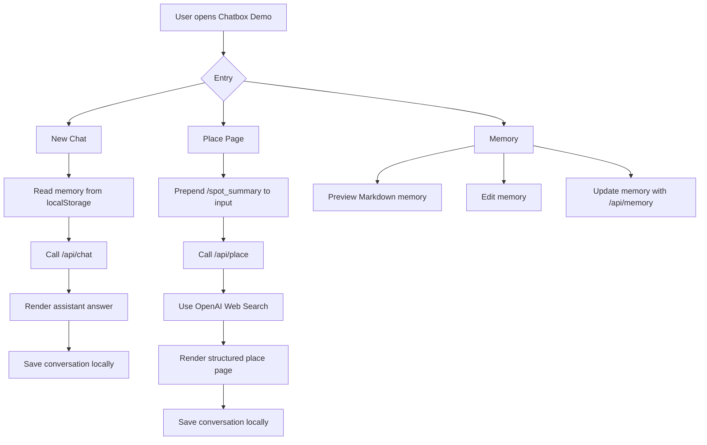
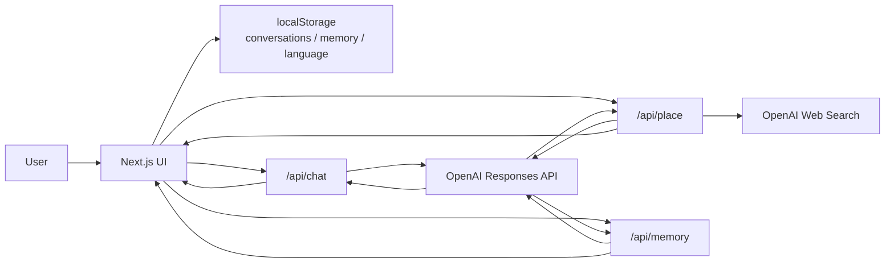

# Chatbox Demo

[日本語](../README.md) | [English](README.en.md) | **中文**

Chatbox Demo 是一个面向 Agent i 式 2C AI 助手思路的小型 Web Demo。  
它不是完整聊天产品，而是用一个简洁界面展示长期记忆、类 Skill 的结构化输出，以及基于网络信息的地点页生成。

这个项目用于 LINE Yahoo / Agent i 相关岗位的作品集展示，不是官方产品。

## 项目动机

面向普通用户的 AI 产品，不能只把大模型放进聊天框里。更重要的是：理解用户上下文，融入日常场景，并把模糊请求转成稳定、有用、产品化的界面。

这个 Demo 用较小范围实现了这个想法：

- 普通聊天可以读取长期记忆。
- 记忆以 Markdown 形式可见、可编辑。
- 地点页通过 `/spot_summary` 触发结构化 Skill。
- 地点页使用 Web Search，让回答和资源尽量基于真实网络信息。

## 核心功能

- **New Chat**：普通 OpenAI 聊天。
- **Place Page**：根据地点生成结构化页面，包括简介、资源、概要和关注点。
- **Memory**：预览、编辑、更新长期 Markdown 记忆。
- **Chat History**：有对话后才出现在历史记录里。
- **Language Switch**：支持日语、英语、中文 UI。
- **Local-first Storage**：聊天、记忆、语言设置保存在浏览器 `localStorage`。

## 本地运行

```bash
npm install
npm run dev
```

打开 `http://localhost:3000`。

## 环境变量

复制 `.env.example` 为 `.env.local`。

```bash
OPENAI_API_KEY=
OPENAI_MODEL=gpt-5.4-mini
OPENAI_PLACE_MODEL=gpt-5.5
```

不要提交 `.env.local` 或任何 API key。

## 运作流程



## 架构图



## 项目结构

```txt
app/
  api/
    chat/      # 普通聊天 API
    memory/    # 记忆更新 API
    place/     # 地点页生成 API
components/   # UI 组件
lib/          # 数据结构、存储、i18n、fallback 逻辑
docs/         # 多语言 README
```

## 范围控制

为了保持面试 Demo 清晰，当前不做：

- 登录 / 多用户
- 数据库
- 向量检索
- 地图 API
- 复杂 Agent 框架
- 后台管理系统

重点是展示：记忆系统和结构化 Skill 如何让一个 AI chatbox 更像真实产品。

## 后续改进

- 部署公开体验网站。
- 改进 Place Page 的资源提取质量。
- 记忆更新前增加确认 UI。
- 准备多套 demo 用户记忆。
- 面向公开部署增加简单 rate limit。
